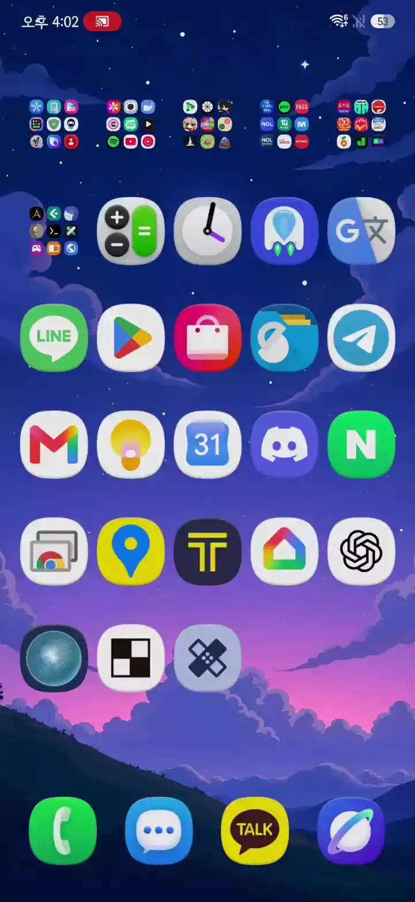
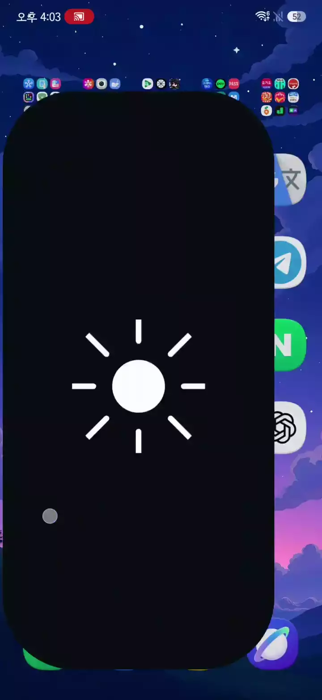
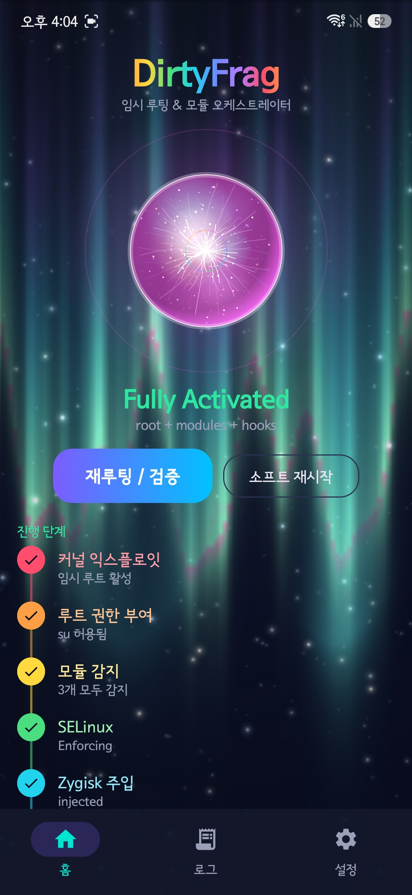
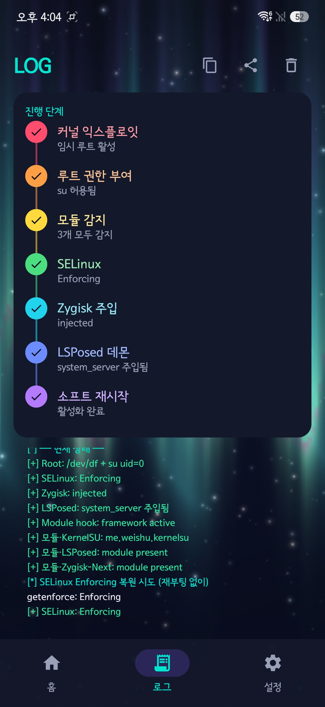
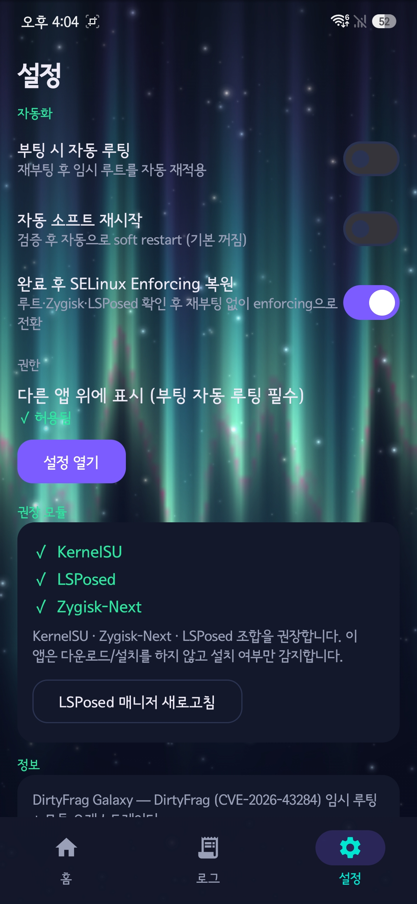

# DirtyFrag-Galaxy

<p align="right">
  <b>한국어</b> · <a href="README.en.md">English</a>
</p>

<p align="center">
  
</p>

<p align="center">
  <b>DirtyFrag(CVE-2026-43284)</b> 익스플로잇으로 삼성 갤럭시 기기에<br>
  <b>원클릭 임시 루트(KernelSU late-load)</b> 를 적용하는 도구입니다.<br>
  <b>Shizuku·PC·ADB 없이</b> 앱에서 익스플로잇부터 KernelSU late-load까지 직접 수행합니다.
</p>

<p align="center">
  <a href="../../releases/latest">최신 APK 다운로드</a>
</p>

> ## ⚠️ 경고
>
> **I am not responsible for bricked phones. — 벽돌된 폰에 대해 책임지지 않습니다.**
>
> * 이 도구는 파티션을 플래시하지 않는 **임시 루트(late-load)** 방식이라 KNOX 워런티 비트를 트립하지 않습니다.
> * DirtyFrag 취약 커널에서 동작합니다. 미취약 또는 호환되지 않는 커널에서는 **patch/primitive 검증 단계에서 중단하며 루트 획득 단계로 진행하지 않습니다.**
> * **반드시 본인 소유 기기**에서만 실행하세요.
> * 루트가 활성화된 동안 일부 앱(금융·정부·DRM 등)은 루트를 감지해 실행을 거부할 수 있습니다.
> * 무보증. 사용에 따른 모든 책임은 사용자에게 있습니다.

---

## 지원 기기 / 커널

이 앱은 `uname`에 표시되는 **Android KMI 계열(`androidNN`) + 커널 `major.minor`** 를 기준으로 커널 모듈(KO)을 자동 선택합니다.

> `androidNN`은 사용자가 보는 Android 버전 번호와 반드시 동일하지 않을 수 있으며, `uname -r`에 표시되는 **Android kernel/KMI 계열**을 의미합니다.

아래는 현재까지의 실측 결과입니다.

| 기기            | 모델                | 커널                  | 결과                    |
| ------------- | ----------------- | ------------------- | --------------------- |
| 갤럭시 Z 폴드8 울트라 | `SM-F976N` (q8q)  | `6.12.58-android16` | ✅ 성공 (기준)             |
| 갤럭시 S25       | `SM-S931N` (pa1q) | `6.6.98-android15`  | ✅ 성공                  |
| 갤럭시 S24+      | `SM-S926N` (e2s)  | `6.1.157-android14` | ❌ CBC primitive NO-OP |

* 핵심은 단순한 커널 major.minor가 아니라 **DirtyFrag에 필요한 커널 primitive가 실제로 존재하고 동작하는지 여부**입니다.
* 현재 실측에서는 `6.6.98-android15`, `6.12.58-android16`에서 동작했고, `6.1.157-android14`에서는 CBC primitive가 NO-OP으로 확인되어 동작하지 않았습니다.
* **커널 버전 번호만으로 취약 여부를 보장하지 않습니다.** 제조사별 패치와 backport, 커널 트리 차이 및 exploit 환경에 따라 실제 결과가 달라질 수 있습니다.
* upstream Linux CVE 데이터의 수정 기준도 별도로 존재하므로, 단순히 `6.1 = 패치`, `6.6 = 취약`처럼 일반화하지 않습니다.
* 검증된 기기에서는 현재 **50회 연속 루팅 시도에서 100% 성공**을 확인했습니다.

### 내장 KO

```text
android12-5.10
android13-5.10
android13-5.15
android14-5.15
android14-6.1
android15-6.6
android16-6.12
android17-6.18
```

위 KMI에 대응하는 KO가 앱에 내장되어 있으며, 모든 대상 기기/펌웨어에서의 동작을 보장하는 것은 아닙니다.

---

## 요구사항

* DirtyFrag에 필요한 primitive가 존재하는 **삼성 갤럭시** 기기
* **[KernelSU 매니저](https://github.com/tiann/KernelSU/releases)** 앱 — 이 앱에 **포함되어 있지 않으므로 별도 설치** (테스트: v3.3.0)
* (모듈 사용 시 권장) **[Zygisk-Next](https://github.com/LSPosed/ZygiskNext)** (테스트: v1.5.0) · **[LSPosed](https://lsposed.zip)** (테스트: **LSPosed-it v2.2.0 / build 7854**)
* 이 앱은 파티션을 플래시/수정하지 않으므로 **재부팅 시 루트가 풀립니다**(자동 루팅을 켜면 자동 재적용).

## 사용법

1. **[KernelSU 매니저](https://github.com/tiann/KernelSU/releases)** 앱을 설치합니다(별도).
2. [Releases](../../releases/latest) 에서 이 앱의 APK를 설치합니다.
3. 앱을 열고 **루팅** 버튼을 누릅니다. (익스플로잇 → 임시 루트 → KernelSU late-load)
4. 루트 권한 알림이 뜨면 **KernelSU 매니저 > 슈퍼유저** 에서 이 앱(DirtyFrag Galaxy)의 ROOT 스위치를 켭니다.

### 첫 사용자(모듈 미설치) — 순서 중요

> **모듈은 루트를 얻은 뒤에만 설치할 수 있습니다.** 아래 순서대로 하면 됩니다.

5. 4단계까지 마치면 앱이 자동으로 모듈을 확인하고, 없으면
   **"모듈 설치가 필요합니다" 알림**(+ "매니저 열기" 버튼)을 띄웁니다.
   **KernelSU 매니저 → 모듈** 에서 Zygisk-Next, LSPosed(zip)를 설치하세요.

6. 앱으로 돌아오면 **자동 감지**됩니다(다시 [루팅]을 누를 필요 없음).
   모듈이 준비되면 **"소프트 재시작이 필요합니다 (LSPosed 정상 작동을 위해)" 알림**이 뜹니다.

7. 알림의 **[지금 소프트 재시작]** 을 누르거나 앱 홈에서 **소프트 재시작** 을 누릅니다.
   완료되면 상태가 **Fully Activated** 로 바뀝니다.

8. 필요 시 설정에서 **부팅 시 자동 루팅**을 켜면 재부팅 후 자동으로 루트가 다시 적용됩니다.

> 요약: **루트 → 모듈 설치(알림 안내) → 자동 감지 → 소프트 재시작(알림/원탭).**
> 모듈이 없어도 루트 단계는 정상 진행되며, 앱은 하드 실패 대신 알림·안내·원탭 실행을 제공합니다.

## 이 앱만의 특징

* **Shizuku·PC·ADB 불필요** — 별도의 페어링이나 외부 도구 없이 앱에서 익스플로잇부터 KernelSU late-load까지 직접 수행합니다.
* **루팅 성공률 100%** — 현재 검증된 기기에서 **50회 연속 시도 모두 성공**했습니다.
* **안정적인 소프트 재시작** — 루트 권한을 매니저에서 이 앱에 부여하면 `su` 컨텍스트에서 깔끔하게 모듈 스테이지 + soft reboot 을 수행합니다.
* **7개 상태 지표 실시간 검증 + 헬스 패널** — 익스플로잇 / 권한 / 모듈 / SELinux / Zygisk / LSPosed / 재시작 상태.
* **LSPosed 주입 정확 판정** — `system_server`의 **현재 pid** 기준(`logcat` + lspd verbose, mtime 가드)으로 오탐/부정 제거.
* **다중 KO 자동 선택** — KMI와 커널 버전에 맞는 KO를 자동으로 고릅니다.
* **SELinux 선택화 + 무재부팅 Enforcing 복원** — permissive가 필요 없는 기기는 그대로 동작하고, 필요한 기기(6.12)는 루트·Zygisk·LSPosed 확인 후 **재부팅 없이** SELinux를 `Enforcing`으로 되돌립니다.
* **부팅 자동 루팅** — 포그라운드 서비스 + 알림으로 재부팅 후 자동 재적용.
* **첫 사용자 모듈 설치 안내(알림)** — 모듈(Zygisk-Next/LSPosed)이 없어도 **루트까지는 정상 진행**하고, **"모듈 설치가 필요합니다" 알림 + "매니저 열기" 버튼**으로 안내합니다.
* **자동 감지 + 소프트 재시작 알림** — 매니저에서 돌아오면 **자동 재감지**되고, 루트·모듈이 준비되면 **"소프트 재시작이 필요합니다" 알림(원탭 [지금 소프트 재시작])**이 떠서 바로 진행할 수 있습니다.
* **로그 탭 / 오로라 비주얼** — 상세 로그와 상태 스냅샷.

---

## 부팅 자동 루팅

설정에서 **부팅 시 자동 루팅**을 켜면, 재부팅 후 포그라운드 서비스가 익스플로잇 → `su` 확보 →
모듈 스테이지까지 자동 수행하고 알림으로 진행 상황을 표시합니다.

**자동 소프트 재시작은 기본 꺼짐**입니다(루프 방지를 위해).
LSPosed 활성화가 필요하면 앱에서 소프트 재시작을 한 번 실행하세요.

---

## 참고 및 제한

* 현재 검증된 기기에서는 **50회 이상 연속 루팅 시도 모두 성공**했습니다.
* 검증되지 않은 기기나 다른 펌웨어에서는 동일한 결과를 보장하지 않습니다.
* **미취약 또는 호환되지 않는 커널**에서는 `CBC page-cache primitive is a NO-OP ... Aborting.` 등 patch/primitive 검증 메시지와 함께 중단합니다.
* 스테이지는 **1회만** 실행됩니다. `ksud unload` 는 절대 사용하지 않습니다(기기 다운 방지).

---

## 데모 영상

| 첫 사용자 루팅 | 소프트 재시작 |
|:--:|:--:|
|  |  |

<p align="center">
  <sub>애니메이션 WebP라 자동으로 재생됩니다. (클릭하면 원본 크기로 볼 수 있습니다.)</sub>
</p>

---

## 스크린샷

| 홈 | 로그 | 설정 |
|:--:|:--:|:--:|
|  |  |  |

---

## 빌드

요구사항: **JDK 17**, **Android SDK 36**, **NDK 27.2.12479018**.

```sh
JAVA_HOME=/path/to/jdk-17 ./gradlew :app:assembleRelease
# 출력: app/build/outputs/apk/release/dirtyfrag-galaxy.apk
```

`local.properties` 는 커밋하지 않습니다(`sdk.dir` 을 본인 SDK로 지정).

릴리스 APK는 저장소에 포함된 **AOSP testkey**
(`keystore/testkey.p12`, alias `testkey`, 암호 `android`)로 서명되어,
누구나 동일한 키로 재빌드할 수 있습니다.

개인 배포 또는 별도 릴리스에 사용할 경우에는
`keystore/testkey.p12`를 **본인의 private release key로 교체하고 signing 설정도 함께 변경**하세요.

> 공개 testkey는 재현 가능한 빌드를 위한 기본값이며, 공식 배포용 서명 키로 사용하는 것을 목적으로 하지 않습니다.

### 번들 자산 무결성 (SHA-256)

| 자산                               | SHA-256 (앞자리)       |
| -------------------------------- | ------------------- |
| `assets/ksud`                    | `63046bf5a6409e5f…` |
| `ko/dirtyfrag-android12-5.10.ko` | `8ea7b79bedfba0b5…` |
| `ko/dirtyfrag-android13-5.10.ko` | `97b09bac363ce6bf…` |
| `ko/dirtyfrag-android13-5.15.ko` | `43e5669315b5d710…` |
| `ko/dirtyfrag-android14-5.15.ko` | `f96a0d5ac8f43683…` |
| `ko/dirtyfrag-android14-6.1.ko`  | `a05e62319dcac2e7…` |
| `ko/dirtyfrag-android15-6.6.ko`  | `6658df7da8b2e90a…` |
| `ko/dirtyfrag-android16-6.12.ko` | `cc4cf69f40d00d6f…` |
| `ko/dirtyfrag-android17-6.18.ko` | `32e30b20a71e2ae8…` |

---

## 크레딧

이 프로젝트는 다음 오픈소스 및 연구 결과를 기반으로 합니다.

* https://github.com/lsposed/lspromise — DirtyFrag 원 PoC / exploit chain
* https://github.com/diabl0w/DFRoot — 익스플로잇 체인 / late-load 흐름
* https://github.com/polygraphene/DFReroot — SELinux permissive KO 및 관련 코드 기반
* https://github.com/combeng6th/DirtyInit — unprivileged XFRM/IPsec 기법
* https://github.com/tiann/KernelSU — KernelSU userspace (`ksud`)
* https://github.com/LSPosed/ZygiskNext — Zygisk-Next
* https://github.com/LSPosed/LSPosed — LSPosed

자세한 제3자 라이선스 및 소스 출처는 [NOTICE](NOTICE) 참고.

---

## 라이선스

**이 프로젝트에서 직접 작성한 코드는 Apache License 2.0** 으로 배포됩니다.
[LICENSE](LICENSE) 참고.

번들된 제3자 구성요소는 각각의 원본 라이선스를 따릅니다.

* `assets/ksud` — **GNU GPL-3.0-or-later**
* `ko/*.ko` — DirtyFrag 관련 upstream 구현을 기반으로 한 커널 모듈. 각 모듈의 실제 소스 출처와 라이선스 상태는 [NOTICE](NOTICE)에 명시합니다.
* `ko/*.ko`에 대해 upstream에서 명시적인 repository-level 라이선스가 확인되지 않는 경우, 임의로 GPL-2.0 또는 GPL-3.0으로 표기하지 않고 **원본 출처와 라이선스 미지정 상태를 그대로 기록**합니다.

제3자 구성요소의 라이선스를 본 프로젝트의 Apache-2.0 라이선스로 재라이선스하지 않습니다.
